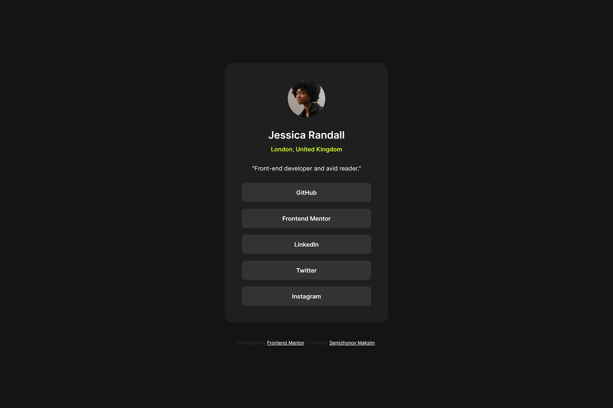
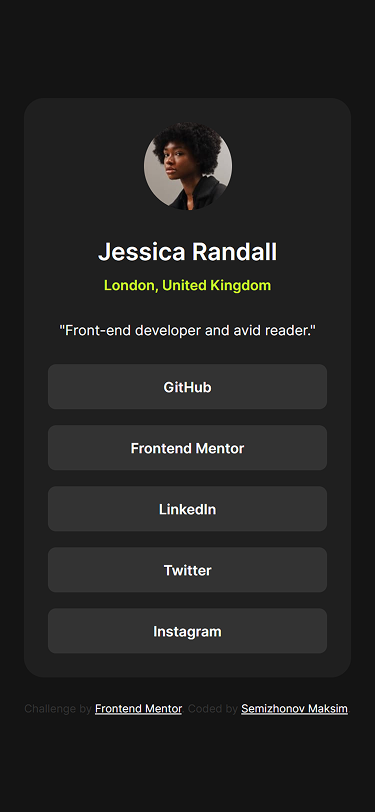
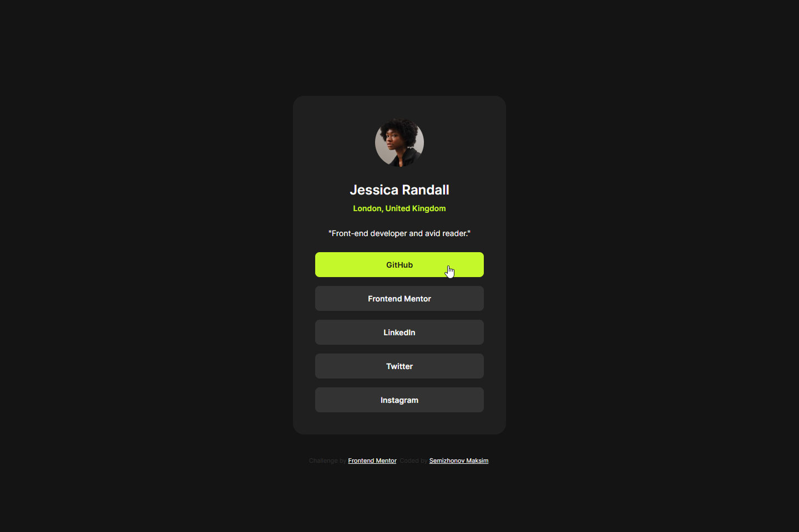
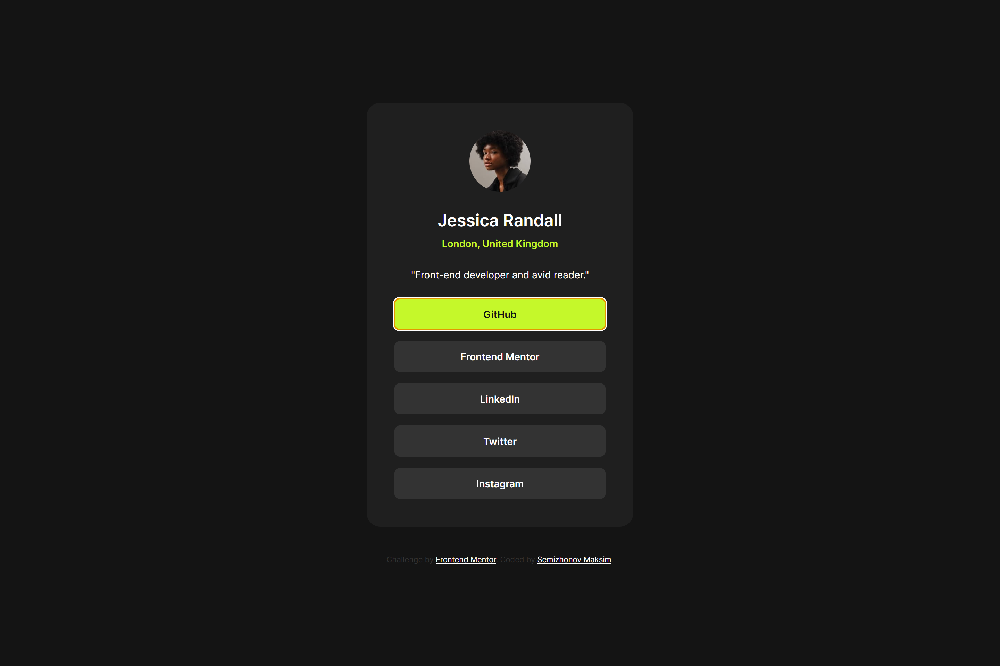

# Frontend Mentor - Social links profile solution

This is a solution to the [Social links profile challenge on Frontend Mentor](https://www.frontendmentor.io/challenges/social-links-profile-UG32l9m6dQ).

## Table of contents

- [Overview](#overview)
  - [The challenge](#the-challenge)
  - [Screenshot](#screenshot)
  - [Links](#links)
- [My process](#my-process)
  - [Built with](#built-with)
  - [What I learned](#what-i-learned)
  - [Continued development](#continued-development)
- [Author](#author)

## Overview

### The challenge

Users should be able to:

- See hover and focus states for all interactive elements on the page

### Screenshot
<table>
  <tr>
    <th >Desktop (1440px)</th>
    <td></td>
  </tr>
  <tr>
    <th>Mobile (375px)</th>
    <td></td>
  </tr>
  <tr>
    <th>Hover</th>
    <td></td>
  </tr>
  <tr>
    <th>Focus</th>
    <td></td>
  </tr>
</table>

### Links

- Solution URL: [GitHub Repository](https://github.com/incmoga/social-links-profile-main)
- Live Site URL: [Live Demo](https://incmoga.github.io/social-links-profile-main/)

## My process

### Built with

- Semantic HTML5 markup
- CSS custom properties
- Flexbox
- Responsive design
- CSS transitions for hover effects
- Variable fonts

### What I learned

### Continued development

## Author

- GitHub - [Maksim Semizhonov](https://github.com/incmoga)
- Frontend Mentor - [@incmoga](https://www.frontendmentor.io/profile/incmoga)
